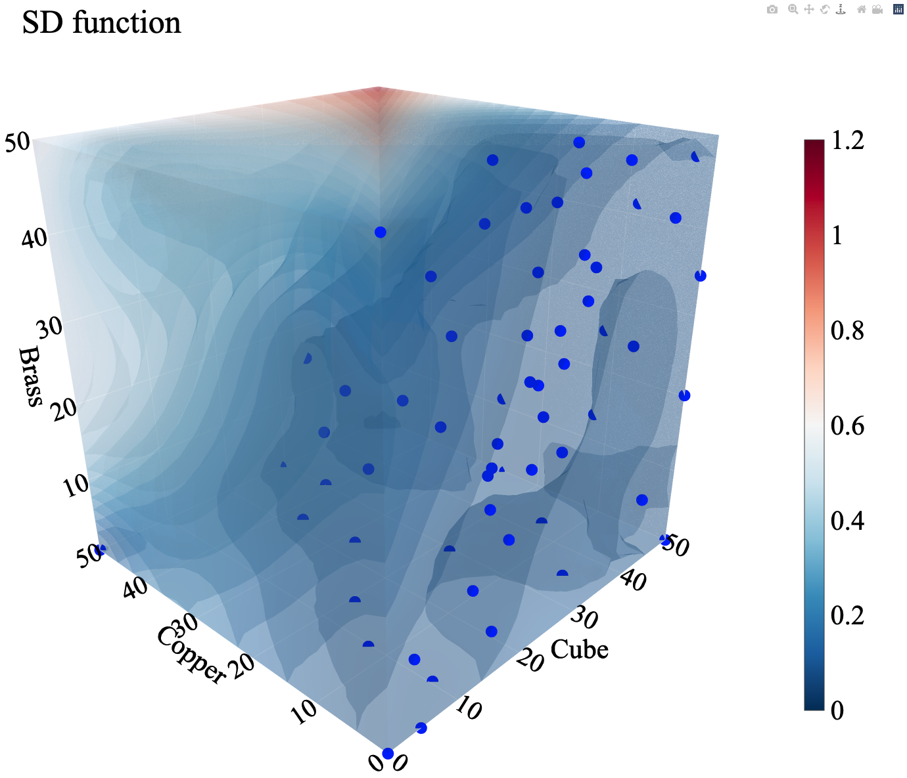

# Bayesian Texture Optimization using Deep Neural Network-based Numerical Material Test 
-----

## Description
- Bayesian Texture Optimization using Deep Neural Network-based Numerical Material Test (BayesTexOpt) project provides neural network (NN) structure (named DNN-3D), training parameters (weights and biases for the NN) and training datasets reported in the paper (R. Kamijyo et al., (2021) submitted). 
- Using the DNN-3D, one can perform optimization of crystallographic texture in an aluminum alloy sheet to reduce in-plane anisotropy of Lankford value. 
- The DNN-3D is constructed on TensorFlow and Keras. 
- This repository also provides 3D-viewer to flexibly visualize the optization result. 
- This project is related to <a href="https://github.com/Yamanaka-Lab-TUAT/DNN-NMT">Deep Neural Network-based Numerical Material Test (DNN-NMT)</a> project. 
- The detailed methodology can be found in the following publications. 

## Publications 
1. R. Kamijyo, A. Ishii, and A. Yamanaka, Bayesian Texture Optimization using deep neural network-based numerical material test, (2021), submitted. 

2. A. Yamanaka, R. Kamijyo, K. Koenuma, I. Watanabe and T. Kuwabara, "Deep neural network approach to estimate biaxial stress-strain curves of sheet metals", Materials & Design, Vol. 195 (2020), 108970. <a href="https://doi.org/10.1016/j.matdes.2020.108970">https://doi.org/10.1016/j.matdes.2020.108970</a>

3. K. Koenuma, A. Yamanaka, I. Watanabe and T. Kuwabara, "Estimation of texture-dependent stress－strain curve and r-value of aluminum alloy sheet using deep learning", Materials Transactions, Vol. 61 (2020), pp. 2276-2283 <a href="https://doi.org/10.2320/matertrans.P-M2020853">https://doi.org/10.2320/matertrans.P-M2020853</a>. 

## Requirements 
- Anaconda3
- Some python libraries required for the BayesTexOpt can be installed by executing the batch file: 
```bat
tf_env
```

## Usage
### Training DNN
1. Download the training data from <a href="http://web.tuat.ac.jp/~yamanaka/opendata.html">Website of Yamanaka Laboratory, TUAT</a>. 
2. Save the training data to any directory. For example, 'E:/'.  
3. Edit "common/rawdata.py" so that ```ROOT_DIR``` is the same directory as that where the training data is saved. 
```python : rawdata.py
ROOT_DIR = 'E:/'
```

4. Run "dataset.py" to prepare the training and validation datasets.  
```bat
conda activate tf_env
python dataset.py
```

5. Run "train_tfmodel.py" to train the DNN-3D using the training dataset. The trained DNN-3D will be saved in the directroy "tf_models/dnn3d/model.py". 
```bat
python train_tfmodel.py
```

6. Run "draw_rvalue.py" to estimate Lankford values using the trained DNN-3D. 

### Texture optimization using the trained DNN-3D
1. Perform "Bayesian Texture Optimization" by running "optimize_rvalue_BO.py". The optimization results are saved to the file named "Opt_result/ev_all.dat". 
2. The parameters of Kernel function used in the Gaussian process regression (GPR) are saved in the file named "Opt_result/model.dat". 
3. The optimization results (i.e., 3D distribution of predictive mean, standard deviation, and acquisition function) can be visualize by running "BayesTexOpt_visualizer.py" with an example data "example_data/ev_all_3d.dat". Afetr running the script, you can rotate three-dimensional graphs of mean function, standard deviation and acquisition function:  



## License
BSD License (3-clause BSD License)

## Author
[Yamanaka Research Group @ TUAT](http://web.tuat.ac.jp/~yamanaka/)
